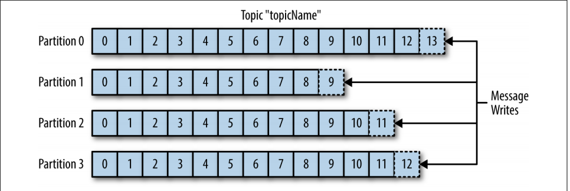

# Microservices and Kafka :hand: fa18-523-53

| Chaitanya Kakarala
| ckakara@iu.edu
| Indiana University
| hid: fa18-523-53
| github: [:cloud:](https://github.com/cloudmesh-community/fa18-523-53/blob/master/paper/paper.md)

---

Keywords: fa18-523-53, Microservices, Kafka, Python

---

## Introduction

:o: images are not properly used and have no labels, see our sample

:o: refernces missing in some sections

:o: please start your section with kafka 

With the increase in demand for Agile methodology (Citation Needed) in software development where the user stories should be completed in a given sprint (Citation Needed - Sprint Definition), there is great need of shrinking down the applications to smaller units. These smaller units are otherwise known as Microservices. These Microservices are loosely coupled and the instructions inside them are light weight. Microservices are autonomous by nature and they can be plugged in any host and bring them up provided the software and hardware requirements are met. As a result, small independent teams can work on these Microservices in parallel and deploy them independently. Depending on the complexity of an application there could be  hundreds of Microservices defined and each of them might interact with each other. In other words, an event occurred on one  Microservice could start another Microservice. With the interactions between these Microservices increasing, it's hard trace the connection between them and hence creating a technical debt to mitigate the issue.
Apche Kafka is designed to solve the above stated problem. It is also known as "Distributed Streaming Platform" which works on a subscribe-publish model. Microservices communicate with each other through a Kafka cluster by either subscribing or publishing the topics rather than communicating directly. Kafka was originally designed in LinkedIn (Citation Needed) to address issue with one of their internal system. The Primary objectives of Kafka were to persist the message data so multiple consumers can access the same and provide horizontal scaling. 

## Architecture

The metric for data in Kafka is message. These messages are nothing but an array of bytes and Kafka is least worried about the content of these messages. Optionally a message can have a key which is again an array of text whose hash value determines the partition the message will be written to. Doing so will guarantee that the messages with same hash value will be stored into the same partition.  Messages can also be sent in batches which in other words, a bunch of messages sent all at once. That leaves us with questions like, what are these messages? Where are they stored? who uses these messages? 
Messages in Kafka are classified into Topics. Topics are nothing but a group of partitions (Can also be described as disk space) where a collection of similar messages are stored. Messages will be appended to these partitions and will be read from beginning to end fashion. The Partitions can be hosted by different servers which makes the topic scale horizontally.
All the partitions for a topic is often termed as Stream
Below figure describes 4 partitions of a single topic (Citation Needed)

There are basically two users of Kafka system. They are Producers and Consumers. Producers create messages to a specific topic. Producers are also termed as publishers. Producers by default does not care which partition they are writing the message to. However, in some cases the hash value of the key decided the partition and ensures all the messages for the same key reside in the same partition. Consumers read messages from the partitions in the order they were published by the producers. Consumers are also termed as subscribers. While reading the messages from partitions, consumers store the offset to to keep track of the read messages. By storing the offset, the system can be re-strated from the point of failure without starting all over again. Consumers are bundled together as a consumer group that restricts a given partition to be read by a unique consumer. Consumer groups helps scaling the consumers horizontally. Below Figure illustrates on how consumer group works (Citation Needed)

A single kafka server is called as Broker. Each broker receives messages from producers and write them to the partitions on the disk. They will then save the offset for each message in a partition They also respond to the consumer programs for data requests from partitions and commit the same. Kafka is designed to have multiple brokers and collection of all of them is termed as a Kafka cluster. Each cluster can have multiple brokers where the leader broker replicates the data to others. Replication of data helps in durability of data even when one of the broker failed working. The below diagram explains how multiple brokers are replicated in a kafka cluster.

The major aspect of kafka is the data retention in the partitions. By default the messages in the partitions will be retained for a period of time or Size. For example, the messages in a topic can be retained for one week or until the partition reaches 1 GB. The default behavior can be overridden for topics by changing their settings. Kafka also supports multiple clusters communicating across multiple data centers.

## Use Cases

Kafka was primarily built in LinkedIn to optimize their activity logging system that has multiple Microservices. When the user does an action from the frontend, messages streams through the kafka cluster which are then subscribed by the backend consumer process. Kafka is also used in organizations for collecting the logs and metrics from their microservices. Since Kafka is analogous to the commit log in databases, it can be used to monitor the databases as an event occurs. Kafka is also used in the applications which are developed to process data in streams.

## Conclusion

Microservices contribute a lot to the organizations especially the ones follow Agile methodology and it's very crucial to understand the data pipeline between these Microservices. Kafka helps in creating an efficient messaging system that helps Microservices interact with one another in a sophisticated manner. I conclude the paper with the below quote from LinkedIn CEO, Jeff Weiner

``Data really powers everything that we do [Jeff Weiner, CEO LinkedIn].``

:o: stay focused on kafka not on the linked in CEO
