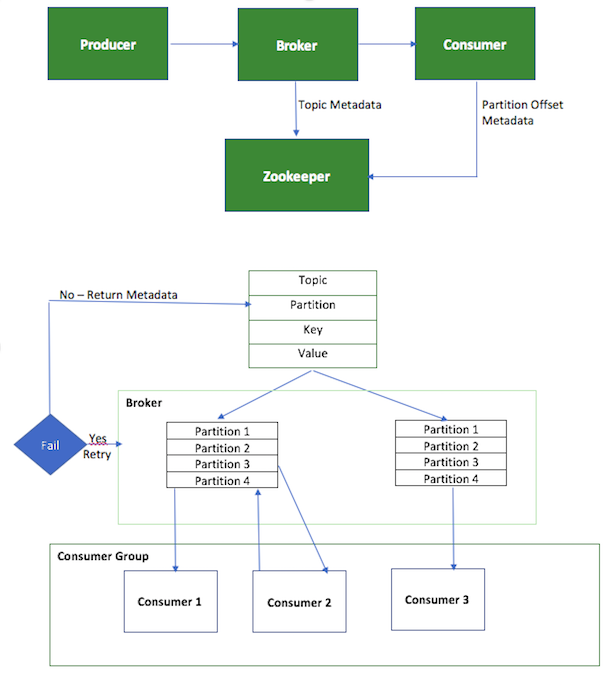

# Orchestrating Microservices for a Credit Scoring Application in Kafka  :o:  fa18-523-53

| Chaitanya Kakarala
| ckakara@iu.edu
| Indiana University
| hid: fa18-523-53
| github: [:cloud:](https://github.com/cloudmesh-community/fa18-523-53/project-report/report.md)
| code: [:cloud:](https://github.com/cloudmesh-community/fa18-523-53/project-code)


---

Keywords: Kafka, Zookeeper, Microservices, Python.

---

## Abstract

This Project deals with orchestration of micro services in a Credit Scoring application using a Kafka cluster. A user keys in his personal identification information in a user interface created in Python and upon submitting the same multiple micro services written in python will be executed. These light weighted and autonomous interact with one another using a Kafka broker Which works in a subscribe-publish model. The user will then see his credit report and the factors that impact his credit.

## Introduction

With the increase in the amount of data being processed there is a great need of developing the applications with better performance. One such technique to make the application perform better is breaking the application into smaller units. These units are light weighted and autonomous in nature. These small applications provides scalability and because of their autonomous nature they can be plugged into any system. These small applications are also known as Microservices. Since we are breaking the big or complex application to multiple small or light weighted microservices, a mechanism to efficiently communicate between these microservices is required. Apache Kafka is one such mechanism which provides a message streaming platform so that the microservices can either subscribe or publish the data. 

## Apache Kafka

Apache Kafka is an open source streaming platform that streams the data in the form of messages. The messages are nothing but a collection of bytes and kafka has nothing to do with the content of these messages. Each of these messages will be tagged with a topic name and these messages will be published into a partition (disk space) of the topic it is associated with. These partitions can be made available across different machines which makes kafka a horizontally scalable streaming platform.
Optionally each of these messages can be given with a key and whose hash values determines the partition it should be saved in. Hence the messages with the same key value will be stacked together in the same partition.

 [@www-kafkaGuide].
  
There are two users of the kafka system. They are producers and consumers. Producers sends the messages and they are also known as publishers. producers while sending the messages does not care about the partition the message is going to save. However, publishing the message with a key value ensures all the messages with same key stored in the same partition. On the other hand consumers consumes those messages by the producers.The consumers saves the offset of each message it reads and process the same. Saving the offset helps restarting from the point of failure in case of an issue rather starting all over again. These consumers can be grouped together called as consumer group and each consumer in the consumer group could be hosted in a different machine which makes the consumer aspect scale horizontally. Consumer groups also restricts the partition to be read by multiple consumers if required. The data retention in each partition can be controlled in different ways. For example the message in a partition can be removed after 1 month or the partition can always be maintained at the capacity threshold set to 1 GB. 

 [@www-kafkaGuide].
  
A single kafka server is called as kafka broker. Each broker receives messages from producers and save them into thier respective partitions. The broker also responds to the consumer requests and saves the offset of the consumed messages. Kafka is designed to have multiple brokers and collection of all such brokers is called as kafka cluster. A leader broker can be defined in each cluster and the data replicates from leader broker to the other brokers to provide high data availability and persistent data. Kafa also supports the communication between the clusters in different data centers.

 [@www-kafkaGuide].
  
## Requirements

A Credit reporting agency would like to create an application to help their customers in finding their credit scores and the factors influence their score. In order to provide the above information, the application require the below personal identification information from their customers. They are:

* Name Salutation (Optional),
* First name,
* Middle Name (Optional),
* Last name,
* Name Suffix (Optional),
* Address Line 1,
* Address Line 2 (Optional),
* City,
* State,
* Zip Code,
* SSN.

Upon collecting the above information from the user, the below rules need to be applied to cleanse and standardize the user input.

* None of the name related information should contain any integers in them. They should be only characters.
* Address lines should be standardized such as Lane to Ln and Circle to Cir.
* City and State should be characters.
* Zip code has to be integer.
* SSN should be a 9 digit integer.

After cleansing and standardizing the user input, below logic has to be applied for determining the score.

* The maximum score one can get is 850
* 10 point reduction should be applied for every credit inquiry
* Existence of a public record should result 200 point reduction
* Every missed payment will result in 100 point reduction
* If the available credit to total debt ratio is less than 10%, there will not be any reduction in score
* If the available credit to total debt ratio is between 10% to 20% , there will  be 20 point reduction in score
* If the available credit to total debt ratio is between 20% to 30% , there will  be 30 point reduction in score
* If the available credit to total debt ratio is between 30% to 40% , there will  be 40 point reduction in score
* If the available credit to total debt ratio is between 40% to 50% , there will  be 50 point reduction in score
* If the available credit to total debt ratio is greater than 50% , there will  be 100 point reduction in score
* The minimum score that one can get is 350.

The application has to designed in such a way that the code can be packaged and implemented in any machine. The services has to be light weighted and autonomous in nature. In case of any issue with the code the user inputs must be guarded and the application should start from the last point of failure. An efficient logging mechanism should be in place for supporting the application.


## Architecture 

The application is designed using below technologies:

* Kafka: Kafka is used as a message streaming tool for establishing a data pipeline between multiple microservices.

* Python: Python is the programming language used for creating the microservices and kafka library are used to publish and subscribe messages to kafka clusters. Tkinter library is used for creating user interfaces.

* Zookeeper: Zookeeper is used for maintaining a centralized configuration information by providing distributed synchronization and providing group services. Apache kafka uses zookeeper for maintaining the configurations.

Figure 4 describes the high level Kafka Architecture

 

## Design

An application is designed to have different services in python which interacts with one another using kafka streams. Below are the different microservices created as part of this application.

* scoringUI: This microservice launches a user interface for the user to input the personal identification information. The service reads each of the user inputs and create a JSON payload. The JSON payload created is sent to kafka partition under 'nameParsing' topic. The service is coded in python and using TKinter and Kafka libraries.

* nameParsingMicroService: This microservice is a consumes the messages from 'nameParsing' topic and then parse the payload. The service also applies the parsing logic to clean all the name related fields. Upon cleansing the name fields, the service creates a payload with parsed name and all the address related fields. The payload is then sent to kafka partitions under 'addressParsing' topic.

* addressParsingMicroService: This microservice consumes the messages from 'addressParsing' topic and applies parsing logic on the address related fields to define the parsed address. The service then creates a payload with parsed name and address to kafka partitions under 'scoring' topic.

* scoringMicroService: This microservice consumes the messages from 'scoring' topic from kafka cluster and applies scoring logic on the subject. This service reads the dataset called 'creditDatabase.csv' for obtaining the required attributes for a given SSN to calculate the score. The service then launches the user interface for the user to check his score and the factors contributing towards the same.

<Figure>
  
Zookeeper saves the offsets of the messages consumed and produced to maintain the configuration information. Kafka requires this information in the event of restarting the application from a point of failure.

## Dataset

A credit database file in csv format is created for this project. Below are the attributes of the dataset.

* SSN : Key field that uniquely identifies a person
* ACTIVE SINCE : This is the date in YYYY-MM-DD format on which date the credit was established for the person
* INQUIRIES : Number of inquiries on the record in the past 3 years.
* CREDIT LIMIT : Total credit limit of the person across all his accounts.
* TOTAL BALANCE : Sum of all current balances reported by different financial institutions.
* PUBLIC RECORD : This attribute is set to "Y" if there are any public records listed for this person. Default Value is "N"
* MISSED PAYMENTS : Number of missed payments by this person from the date of credit establishment.

## Implementation

* Kafka Installation: 
  * Kafka tar file can be obtained from [here](https://www.apache.org/dyn/closer.cgi?path=/kafka/1.1.0/kafka_2.11-1.1.0.tgz). Please download and save it on the server. Please be aware that kafka requires Java to be installed on the server.
  * Untar the downloaded file using below commands
  ```
  tar -xzf kafka_2.11-1.1.0.tgz
  ```
*  If the java version in your server is having a LTS (Long Time Support) then below fix is needed in kafka-run-class.sh located in bin folder under the kafka home directory. This is a known fix and kafka is working to address this issue for future releases [@www-kafkaJavaIssue].

Change below line
```
JAVA_MAJOR_VERSION=$($JAVA -version 2>&1 | sed -E -n 's/.* version “([^.-]*).*”/\1/p’)
```
to
```
JAVA_MAJOR_VERSION=$($JAVA -version 2>&1 | sed -E -n 's/.* version "([^.-]*).*/\1/p')
```
* install below libraries of python
  * json
  * csv
  * os
  * re
  * kafka
  * tkinter

A python library can be installed using pip install commands. Here is the example command line to install kafka library
```
pip install kafka
```

* Start the zookeeper server using the below command. You need to be in kafka home directory to be able to successfully execute the below command.
```
bin/zookeeper-server-start.sh config/zookeeper.properties
```

* Start the Kafka server using the below command. You need to be in kafka home directory to be able to successfully execute the below command.
```
bin/kafka-server-start.sh config/server.properties
```
* Execute below services in different instances
  * nameParsingMicroService.py
  * addressParsingMicroService.py
  * scoringMicroService.py
```
./nameParsingMicroService.py
./addressParsingMicroService.py
./scoringMicroService.py
```

* Execute the UI service
```
./scoringUI.py
```

This command opens a user interface to key in the personal identification information. Provide the details and hit "Check your Score" button. If the SSN provided in the user input does not found in 'creditDatabase.csv' then you will see a "Credit Record Not Found" exception. If not, below user interface will be opened with the credit information.

<figure>


## Conclusion

This project successfully demonstrates the orchestration of microservices using a kafka cluster. The four microservices created in python as part of this credit scoring application interacts with one another using kafka cluster. The project also successfully demonstrates the persistence of data in a kafka cluster for the consumers to request.

## Acknowledgement
The author would like to thank Professor Gregor von Laszewski and associate instructors for their help and guidance.
